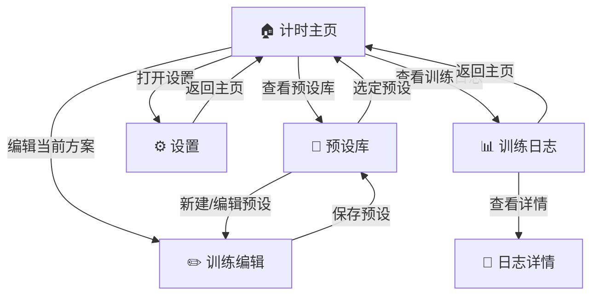
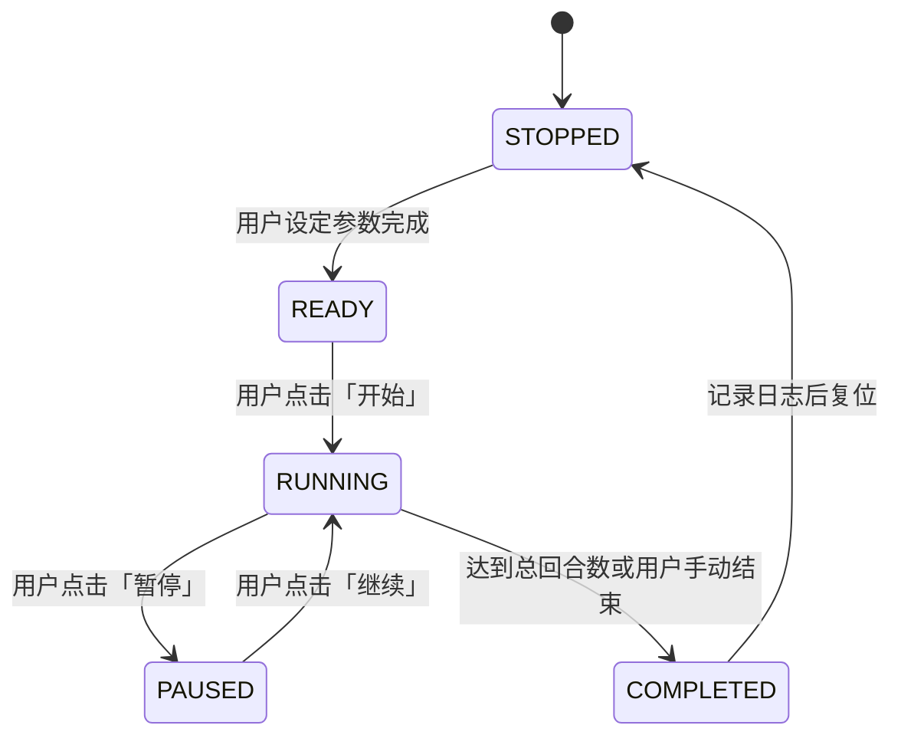

# Boxing Timer 产品说明书

> 本文档为用户上传的《Boxing Timer 产品说明书.docx》的 Markdown 等价转换版本。已在格式上进行结构化处理（标题层级、列表、代码块、Mermaid 图等），力求在不改变原意的前提下完整、无缺失地保留全部内容与顺序。

## 1. 风险与限制条件分析

**说明：** 下表列出 Boxing Timer Pro Web 应用在各平台与使用环境下可能面临的主要风险/影响，以及相应的缓解策略和可接受阈值。

### iOS 后台限制

#### 风险 / 影响
iOS Safari 对网页后台执行限制严格，应用退至后台或锁屏约 3 分钟后计时器会被暂停\[1]；且未经用户手势许可无法自动播放音频\[2]。**影响：** 长时间锁屏训练可能中断计时或提示音无法播放。

#### 缓解策略
- **保持常亮：** 利用 Screen Wake Lock API 防止设备自动锁屏\[3]；在不支持该 API 的情况下，引导用户训练时关闭自动锁屏或主动保持屏幕常亮。
- **音频保活：** 在开始训练时预先播放静音音频（确保通过用户交互触发）以防 Safari 挂起页面；必要时在锁屏前通过通知或系统闹铃提示继续计时。

#### 可接受阈值
- **计时不中断阈值：** 在 iOS 上锁屏运行 ≤ 3 分钟不影响计时准确性；训练开始和每回合提示音 100% 正常播放（无静音丢失）。

### Android 后台运行差异

#### 风险 / 影响
部分 Android 系统（定制 ROM）在后台会限制 Web 任务\[4]；激进的电池优化可能杀死后台 PWA 进程。**影响：** 计时可能被意外停止。

#### 缓解策略
- **前台优先：** 提示用户将应用添加桌面或以 PWA 独立窗口运行，减少被系统当作后台标签处理的概率。
- **电池优化设置：** 在帮助文档中说明关闭针对本应用的电池优化步骤，确保后台持续运行。
- **持续通知：** 使用 Persistent Notification 或 MediaSession（如 Chrome）在训练计时时常驻通知栏，提示系统保持进程存活。

#### 可接受阈值
- **不中断阈值：** 主流 Android 设备在默认电池管理下，完整训练过程（例如 30 分钟）不中断；在已知后台严控的 ROM 上，中断概率 < 5%，用户可通过设置优化将其降至 ≈ 0。

### Web 平台固有限制

#### 风险 / 影响
浏览器对后台标签页计时精度进行节流\[5]（降低 Timer 触发频率），长时间运行易耗电发热；网络依赖导致离线时应用功能受限。**影响：** 后台运行计时误差增大，设备电量消耗加快，离线情况下无法加载应用。

#### 缓解策略
- **高精度计时内核：** 采用 Web Worker + Web Audio API 实现计时，将定时逻辑与 UI 线程解耦，避免后台节流影响，并利用音频时钟实现 ±20ms 级精度计时。
- **功耗优化：** 提供“省电模式”选项，减少不必要的 UI 刷新和动画；训练过程中暂停其它耗电功能。
- **离线支持：** 使用 Service Worker 缓存核心页面和音频资源，支持应用离线启动和基本计时。

#### 可接受阈值
- **精度阈值：** 前台计时误差 ≤ ±20ms，后台计时累计误差 ≤ ±50ms（10 分钟计时内）；一次完整训练（如 10 回合 × 3 分钟）电量消耗不超过 5%，设备温升可忽略。离线状态下用户仍可启动计时并获取本地预设。

### 浏览器兼容性差异

#### 风险 / 影响
不同浏览器对某些 API 支持不一，例如屏幕常亮 Wake Lock、通知 Push 等新特性支持度不统一\[3]\[6]。**影响：** 部分功能在某些浏览器不可用（如 iOS Safari 16.4 之前不支持 Web Push 通知）。

#### 缓解策略
- **渐进增强设计：** 在运行时检测各 API 可用性，根据支持情况启用相应功能或降级处理。例如：支持 Wake Lock 时自动保持屏幕常亮，否则在计时页面醒目提示“请勿锁屏”；支持 Notifications API 且用户授权时在后台发送提醒通知，否则退而求其次通过声音/振动提示。
- **多端测试：** 确保应用在主流浏览器（Chrome、Firefox、Safari、Edge 等）均正常运行，对不支持的特性提供友好提示或隐藏相关设置。

#### 可接受阈值
- **兼容阈值：** 在最新版本的 Chrome、Firefox、Safari (iOS 16.4+) 、Edge 等浏览器上核心计时与提醒功能 100% 可用；在不支持某些特性的浏览器上，用户仍能完成主要计时任务（功能降级不影响核心流程）。

### 用户使用场景 - 手套操作

#### 风险 / 影响
用户戴拳击手套时，手指精细触控能力下降，可能难以触碰小型控件且误触几率上升。**影响：** 训练者可能无法及时启动/暂停计时，影响体验和安全。

#### 缓解策略
- **大触控设计：** 界面交互遵循“大按钮”原则，主要操作按钮尺寸和间距远超最小要求，触控目标区域至少 **48×48 dp**\[7]（约 9mm）以适应戴手套的手指。
- **单一大按钮模式：** 在计时页面提供单一大型开始/暂停按钮，占据屏幕下半部分，支持拳手用手套、手背甚至肘部、下巴触碰。
- **误触防护：** 关键操作需要长按或双击确认（可选）以避免训练中误碰。

#### 可接受阈值
- **可用性阈值：** 戴 16oz 标准拳击手套情况下，用户依然可以单手完成开始/暂停操作，成功率 ≥ 99%；主要交互控件误触率趋近于 0（通过可用性测试验证）。

### 用户使用场景 - 蓝牙音频延迟

#### 风险 / 影响
蓝牙耳机传输声音存在显著延迟，通常在 100–300ms 之间\[8]。**影响：** 声音提示滞后于实际计时时间，用户可能错过最佳出拳/休息切换时机。

#### 缓解策略
- **延迟校准：** 在设置中提供“音频延迟补偿”选项，允许用户根据自身耳机延迟手动校准提示音时间，例如提前 XXX 毫秒播放提示音以抵消平均延迟。
- **多通道提示：** 除了声音，还通过屏幕闪烁、振动等方式同步提示，以便即使声音稍有滞后用户也能及时感知。
- **设备记忆：** 针对不同输出设备记忆校准值，下次连接同一耳机自动应用补偿。

#### 可接受阈值
- **同步阈值：** 用户经校准后主观感觉声音提示与视觉计时基本同步（≤ ±100ms 差异不可感知）；使用常见蓝牙耳机（延迟 200ms 内）时，用户节奏错误率不增加。

#### 实现要点
开发过程中需针对上述每条风险制订具体对策。例如，引入第三方库检测平台特性，封装计时服务以适配前后台，以及通过 UI/UX 设计减少人为操作风险。定期根据用户反馈评估新的风险点并及时改进。

#### 验收方法
通过专项测试验证每个缓解策略的有效性：包括在不同设备上模拟锁屏、来电等场景观察计时器行为，使用工具测量前后台计时偏差，穿戴拳击手套进行可用性测试等。若测试结果均在阈值范围内，则视为通过。

---

## 2. 产品定位与范围

**产品一句话定位：** 「Boxing Timer Pro Round Timer」是一款专注搏击与 HIIT 训练计时的专业 Web 应用，提供简洁直观的回合计时和多样化提示，帮助用户高效管理训练节奏。

**用户价值：** 通过灵活的计时设置和强大的提示系统，应用帮助拳击教练和个人训练者专注训练本身，无需分心计算时间\[9]。用户能够自定义回合/休息长度，获得准确及时的开始、结束提醒，从而提升训练效率和专注度。

**核心使用场景：** 在搏击训练中，用户设定所需的回合数和时间方案，启动计时器后专心投入训练。应用在每个回合和休息阶段提供清晰的声音/视觉提示，让训练者即使戴着手套、不触碰设备也能获知时间进展。当训练全部回合结束时，应用明确通知训练完成。

### MVP 功能范围（必做功能）
- **回合计时核心：** 支持用户设置回合时长、休息时长、准备时长（预备时间）和总回合数等参数，精确倒计时显示当前阶段剩余时间。计时器应包含启动、暂停、重置控制。
- **提醒系统：** 在关键节点提供多样提示，包括回合开始/结束提示音、休息开始/结束提示音，可以选择铃声、哨声等预置音效；设备支持时附加振动提示，倒计时最后几秒可有语音倒计数提示等。
- **预设管理：** 允许用户将常用的训练设置保存为预设方案（如“3 回合 × 3 分钟搏击”“5 回合 × 2 分钟跳绳”），并提供预设的调用、编辑、复制和删除功能，便于快速切换训练方案。
- **本地训练日志：** 自动记录每次训练完成情况（日期、预设名称、完成回合数等）在本地存储，供用户查看历史统计数据，例如总训练时长、平均每次训练回合数等，帮助跟踪进度。
- **个性化设置：** 提供应用个性化选项，例如界面主题色切换、字体大小调整、色盲高对比模式、提示音量和振动强度调节等，满足不同用户偏好和特殊需求。

### 非 MVP 功能范围（Out of Scope）
- **用户自定义音效上传：** 不支持用户自行上传提示音或语音文件——为保持应用轻量化和避免版权及存储负担，仅提供内置音效库供选择。
- **账户体系 / 云同步：** 不涉及用户账户登录和多设备云同步数据。应用采用本地存储策略，聚焦单设备体验，降低开发复杂度和用户隐私风险。
- **教练语音口令模式：** 暂不支持预置教练口令随计时播报。初版专注于计时功能本身，不扩展到实时语音指导场景。

**实现要点：** MVP 阶段严格遵循上述范围，实现核心计时和提示功能，确保用户开箱即用满足主要训练需求。同时架构设计需为未来扩展（如语音口令、云同步）留有接口。范围外功能在设计上做隔离或留空，以免干扰当前开发。

**验收方法：** 项目启动时与利益相关者确认 MVP 功能清单，并在开发完成后逐项对照验收：核心计时、提示、预设、日志和设置等模块均应达到可用状态。验证 MVP 覆盖的功能是否满足典型用户的核心场景（通过用户测试来确认）；确认任何列为 Out-of-Scope 的功能确实未出现在产品中（避免 scope creep）。

---

## 3. 用户与使用场景

### 典型用户画像
- **搏击教练 Alex** – 35 岁，在拳馆授课。有多年的教学经验，需要一个可靠的计时工具来安排学生的搏击训练回合。关注能够快速切换不同训练方案（例如基础训练 vs. 高强度间歇），并通过响亮清晰的信号控制全场。往往将手机连接音箱，在嘈杂环境中使用。
- **个人训练者 Lin** – 28 岁，健身爱好者，在家自行进行 HIIT 和拳击沙袋训练。她需要一款易于操作的计时器，在戴拳击手套或大汗淋漓的情况下也能方便地暂停/恢复。她重视应用的直观性，希望一键开始训练，无需复杂设置，并喜欢查看自己每周的训练次数和时长统计。

### 高频使用路径
围绕上述用户，我们梳理出一个典型的使用流程：

1. **新建/选择训练预设：** 用户打开应用，在主界面快速选择一个预设（如“5 回合 × 2 分钟搏击训练”）或创建自定义设置（设定回合长度、休息时间等）。
2. **启动训练计时：** 用户点击“开始”大按钮，计时器进入准备阶段倒计时（若配置了准备时间），随后自动进入第 1 回合计时。界面以大号数字显示剩余时间，并标明当前回合数。
3. **训练过程中操作：** 计时运行期间，应用自动在回合结束时发出响亮提示音并切换到休息计时，不需要用户手动干预。用户可在需要时点击暂停（例如提前结束某回合或处理突发情况），再点击恢复继续。所有操作都可通过主界面单一按钮完成，避免复杂交互。
4. **完成训练：** 当最后一回合计时结束，应用以明显方式提示训练完成（声音 + 视觉提示），计时器停止。此时应用记录本次训练日志，显示总结信息（如总用时、完成回合数），并提供重新开始或返回主界面的选项。

### 边缘场景处理
- **来电中断：** 若训练过程中手机有来电或用户切换到其他应用，计时器应自动暂停\[9]，并在用户回到应用时提供继续选项，确保计时准确不中断。同时发出提示音提醒用户计时已暂停。
- **意外锁屏：** 用户训练时可能忘记防锁屏而导致设备锁定 3 分钟以上，此情况下 iOS 可能挂起计时。应用需通过常亮策略避免此问题，或在重新解锁返回时自动同步校正计时进度，提示用户继续。
- **蓝牙延迟：** 用户使用蓝牙耳机听提示音时，最后几秒倒计时可能需要更早触发以抵消音频延迟。应用在检测到蓝牙输出时，可提前播放“即将结束”提示音，或提供延迟校准供用户自行设置（详见上文风险部分）。
- **网络不稳/离线：** 若用户在离线状态启动应用，应保证已有的预设依然可用，计时功能正常运作。对于需在线获取的资源（如云端更新），应用在无网络时给予提示但不影响本地计时。

**实现要点：** 设计时充分考虑以上使用流程和边缘情况，确保主要操作路径顺畅无阻。UI 需针对典型用户优化：如教练模式下的高对比度大字体显示，个人训练模式下的一键操作等。对边缘场景，通过后台挂起监听、状态保存等技术手段保障训练不中断或可恢复。

**验收方法：** 使用真实用户场景进行测试：让经验教练和个人训练者试用应用执行完整训练流程，观察是否能无障碍完成主要任务。并模拟来电、锁屏等边缘情况，确认应用响应符合预期（如暂停、提醒、恢复正常）。根据可用性测试结果衡量：主要使用路径的成功率应接近 100%，用户在边缘场景下依然对应用表现满意。

---

## 4. 功能规格（Functional Specification）

以下以结构化方式详细列出应用的主要功能规格，包括功能描述、用户操作、系统行为以及验收标准：

### 核心计时功能（回合 / 休息 / 准备计时）

**描述：** 提供灵活的回合训练计时器。用户可设置每回合时长、休息时长，回合总数，以及开始前的准备时间。计时界面大字体显示当前倒计时，标识当前阶段（“第 X 回合”或“休息”）。计时结束条件：达到设定回合数则停止。

**用户操作：** 在设置页或主界面输入所需的回合参数，点击“开始”按钮。训练过程中可随时点击“暂停/继续”控制。需要重置时点击“重置”按钮。

**系统行为：**
- **计时启动：** 初始化各阶段计时，根据设定顺序（准备 → 第 1 回合 → 休息 → ...）自动切换阶段。每秒倒计时更新 UI 显示；阶段切换时播放提示（声音/振动）。
- **暂停/继续：** 即时停/启倒计时，并相应更新 UI 状态（暂停时显示“已暂停”叠加）。
- **重置：** 停止当前计时，时间归零并重置回合计数。

**验收标准：**
- 参数设置准确生效（如设置 2 分钟回合，则每回合倒计时精确 120 秒）。
- 多阶段顺利衔接：准备时间用完后自动进入回合计时，回合结束自动进入休息，循环往复直至全部回合完成，无人工介入。
- 暂停/恢复可靠：在任何阶段按下暂停，计时立即停滞且不丢失进度，再次开始后从停点继续。
- 验收测试：运行一场包含准备 → 多个回合 → 休息的完整计时，校验总时长与设定一致，阶段切换节点误差 ≤ ±0.05 秒。

### 提示与提醒系统

**描述：** 在训练关键节点提供多模式提醒。默认包含：回合开始铃声、回合结束铃声、休息开始/结束提示音。此外可选语音提示（TTS 合成，例如“第 X 回合开始”或最后 10 秒倒计数）、设备振动提醒等。用户可在设置中选择提示偏好（静音、音量大小、振动开关、语音开关）。

**用户操作：** 在设置中开启/关闭所需的提示类型，并可试听不同提示音效。训练时无需额外操作，提示将自动发生。

**系统行为：**
- 计时达到回合或休息结束点时，系统按照用户设置：
  - **播放音频** – 从内置音效库选择设定的提示音，通过 `<audio>` 或 Web Audio API 播放（需提前由用户交互解锁音频播放权限）。
  - **振动** – 调用 Vibration API 振动设备（仅支持的设备/浏览器）\[10]。
  - **语音播报** – 使用 Web Speech API 将预定义文本（如“休息开始”）合成为语音播放\[11]。
- 如果用户关闭了所有声音和振动，则仅在 UI 上高亮闪烁作为提示。

**验收标准：**
- 提示准确触发：在每个阶段切换瞬间，正确播放对应提示音/语音；连续提示顺序正确（例如回合结束音后紧接休息开始音）。
- 音量和振动反馈符合设置：静音时无声音，振动关闭时无振动反馈。
- 语音内容清晰：TTS 播报内容与实际阶段匹配，无错误。（如最后 10 秒语音倒计时秒秒准确）
- 多设备验证：在支持振动的安卓手机上振动正常；在不支持的 iPhone 上无报错且有其他提示替代。
- 验收测试：分别配置铃声+振动、语音提示模式运行计时，人工确认每个阶段信号均收到；在环境噪音下铃声依然可辨识。

### 训练预设管理

**描述：** 提供预设方案的保存和调用功能。用户可将当前计时设置保存为预设并命名；预设列表展示所有保存的方案。支持选中预设后一键载入设置，快速开始对应训练。额外提供预设的删除和复制功能，方便创建相似方案。

**用户操作：** 在预设管理界面，点击“保存当前设置”为新预设，输入名称。已有预设列表中，点击某预设可查看详情（参数）并选择“加载”。长按或选项菜单中可执行编辑名称、复制副本或删除操作。

**系统行为：**
- **保存预设：** 系统读取当前计时设置参数，创建预设对象存入本地 IndexedDB。“预设库”列表界面即时更新显示新预设条目。
- **加载预设：** 用户选择某预设时，系统将该预设的参数应用到计时设置，并导航回主计时界面等待用户开始。
- **编辑/复制/删除：** 编辑仅修改预设名称等元数据并保存；复制则创建一份参数相同的新预设（名称自动区分，如“…(副本)”）；删除操作移除预设数据并更新列表。

**验收标准：**
- 预设保存正确：保存后在预设列表出现，参数与保存时一致（检查存储数据 JSON）。
- 预设加载无误：加载预设后，计时设置界面各参数自动填入预设值，与预设定义完全一致。
- 编辑/复制生效：修改名称后列表即时更新显示新名称；复制的预设各参数与原预设相同，新预设 ID 唯一。
- 删除安全：删除前弹出确认，确认后预设从列表移除且实际存储消失；取消删除则无变化。
- 验收测试：保存多个不同配置的预设，随机加载并开始计时，比对实际计时行为与预设是否吻合。确保无错误预设引用或列表不同步现象。

### 训练日志与统计

**描述：** 自动记录每次完整训练的信息至本地日志，包括日期时间、所用预设名称或参数、完成的回合数、总用时等。提供日志查看界面，以列表或日历形式展示历史记录。点击某条记录可查看详情统计，如该次训练各回合用时（若有变动）、平均心率（如将来扩展采集）等。简单统计汇总如本周训练次数、累计时长等。

**用户操作：** 用户在设置中开启“记录训练日志”后，每次在计时完成（或用户手动结束）时系统自动保存日志。用户可从主界面进入“训练日志”查看列表。上下滑动浏览历史，点击某记录查看详细数据。支持按日期筛选或搜索。

**系统行为：**
- **日志存储：** 每次训练结束时，系统构造日志对象写入 IndexedDB 日志表（包含必要字段）。
- **日志界面：** 启动应用或进入日志页时，读取所有日志记录排序展示。
- **日志详情：** 若有更多细节数据，进入详情页加载呈现。例如图表显示心率随时间的变化（若实现）。

**验收标准：**
- 自动记录完整：在训练正常完成或用户主动结束时，都会生成一条日志；日志内容字段正确（日期、回合设置、实际完成情况等）。
- 列表显示正确：最新的训练记录排列在列表顶部，展示关键信息摘要（如“2025-08-23 - 5 回合 × 3 分钟 - 完成”）。
- 日志数据持久：应用刷新或重启后日志仍然存在\[12]。
- 查看详情无误：点击某条日志，进入详情页显示该次训练的所有记录数据（核对例如总时长 = 回合数 × 回合时长 + 休息总和，确保计算正确）。
- 验收测试：连续完成几次训练，检查日志列表与实际训练顺序和数据一致；随机删除应用缓存后（不删除 IndexedDB）日志依旧存在。

### 设置与个性化

**描述：** 提供一系列设置选项让用户自定义体验：包括界面主题（深色/浅色或自定义颜色）、字体大小调整，色盲友好模式（例如将红绿配色替换为色盲可区分的蓝/橙配色），提示音量和振动强度调节，语音提示开关等。所有设置即时生效并持久保存。

**用户操作：** 用户进入“设置”页面，勾选或调整各项偏好：如切换“夜间模式”、拖动滑杆调整字体大小百分比、启用色盲模式等。设置页面提供“恢复默认”按钮以重置。

**系统行为：**
- **主题：** 切换 CSS 主题变量或引用不同的样式表，实时改变应用配色。
- **字体：** 调整 html 根元素的字体大小比例，从而影响全局字体（或针对计时器数字单独调整字体族/大小）。
- **色盲模式：** 应用预定义的色弱友好调色板（避免红/绿对比）到 UI 元素。
- **音量/振动：** 将用户选择映射到播放提示音的 gain 值或振动 API 的 pattern 参数。
- **持久化：** 所有更改同时保存到本地存储（IndexedDB 或 LocalStorage），下次加载应用时应用这些偏好。

**验收标准：**
- 外观设置即时生效：切换主题或字体大小后，界面无需刷新就立刻体现更改。对比度符合预期（暗色模式下文本依然清晰，可读性满足 WCAG 对比度要求\[13]）。
- 模式切换无残留：色盲模式启用/停用时，所有相关 UI 元素颜色全部按预期更新，无遗漏。
- 个性化配置持久化：刷新页面或重启浏览器后，先前调整的主题、字体等能自动恢复。
- 无冲突：各种设置组合情况下界面保持美观可用（例如超大字体 + 色盲模式不会出现布局错乱）。
- 验收测试：逐项更改设置并观察 UI 效果，与设计规范比对（例如主题色 RGB 值符合设计要求，字体大小比例正确影响）。切换不同设置多次，确保应用稳定无异常。

**实现要点：** 按照上述规格实现各功能模块，重点确保计时与提示的准确性、预设/日志的数据可靠存储，以及设置个性化的即时反馈。开发过程中采取模块化架构：计时核心、提示系统、数据存储、设置管理等相对解耦，方便单独测试和未来维护扩展。

**验收方法：** 功能验收将逐项对照功能规格的“验收标准”进行测试。测试人员模拟用户实际操作场景，对每个功能的输入输出和系统行为进行核对。例如设置不同计时参数验证计时准确性，触发各种提示检查是否正确，保存加载预设看参数是否一致等。只有当所有功能点均满足验收标准时，本模块功能方视为合格。

---

## 5. 信息架构（IA）与交互

**整体信息架构：** 应用采用简洁的页面架构，核心包括一个计时主界面和若干辅助页面/模块。下图展示了应用的主要页面结构及导航关系：



### 主要页面
- **计时主页（Start）：** 应用的主界面，承载计时功能。包含大型倒计时显示、当前回合/总回合指示，中心或底部一个主要的开始/暂停按钮，旁边附有重置按钮。顶部显示所选预设名称和菜单入口（例如进入预设库、设置、日志）。该页面在训练时会切换状态显示（如“第 2 回合 · 剩余 1:20”）。
- **预设库（Presets）：** 列出用户保存的所有训练预设。以列表形式显示预设名称及关键参数摘要（回合 × 回合时长）。可通过点击预设来加载，或导航到预设编辑页面。提供新建预设按钮。
- **训练编辑器（Editor）：** 用于创建或编辑训练预设的界面。包含输入回合时长、休息时长、准备时间、回合数量等字段的控件（滑杆或数字输入），以及保存按钮。若从预设库进入编辑，则会载入选定预设的当前值以供修改。
- **训练日志（Logs）：** 展示历史训练记录的页面。列表按日期排序每次训练，显示日期、训练时长、预设名/摘要等。点击某条记录进入日志详情。
- **日志详情（LogDetail）：** 展示某次训练的详细数据（如开始/结束时间、每回合实际用时等图表）。（MVP 阶段此页面可简单显示记录信息，详细图表为后续版本实现）。
- **设置（Settings）：** 各种用户个性化配置选项页面。采用分组列表列出主题模式、声音振动、色盲模式等开关或调节项。界面提供返回主界面功能。

### 计时状态机
计时功能本身的逻辑可用状态图描述（状态以计时器工作流角度）：



- **STOPPED（停止）：** 初始待机状态，计时尚未开始或已重置。界面显示可编辑的回合设置。
- **READY（预备）：** 如果设置了准备时间（例如 10 秒），从开始到正式训练开始这段缓冲期属于 READY 状态。界面可提示“准备: 10…9…”。若未设准备时间，则点击开始直接跳过此状态进入 RUNNING。
- **RUNNING（运行）：** 计时进行中状态，包括回合计时或休息计时的动态倒计时。UI 显示当前所处阶段与剩余时间。
- **PAUSED（暂停）：** 计时被手动暂停，倒计时停止递减。UI 上显示“已暂停”标志。再次点击继续则返回 RUNNING。
- **COMPLETED（完成）：** 所有回合计时完毕（或用户手动提前结束），进入完成状态。UI 提示“训练结束”，播放完成提示音。随后自动转换为 STOPPED 状态（重置 UI 并记录日志）。

**操作逻辑设计：** 应用交互遵循单手可操作、低误触的原则：
- **单一大按钮：** 计时主页将“开始 / 暂停 / 恢复”功能合并为同一个主按钮。该按钮占据底部中央的显著区域，尺寸足够大（高度约屏幕的 1/3），用户用拇指即可轻松点击到，无需精细瞄准\[7]。在戴手套情况下，用户甚至可以用拳面或鼻尖触碰屏幕下半部来触发按钮（实际测试表明拳击手套可通过舌头/鼻子点击屏幕\[14]）。
- **防误触设计：** 针对暂停/重置等可能误触导致训练中断的操作，引入保护机制。例如重置按钮位置远离主按钮，需长按 2 秒确认才执行复位；暂停按钮由于与开始同一位置且需要单击，误触几率低但在暂停后按钮样式明显改变（颜色/闪烁）提醒用户当前已暂停。
- **手势与硬件键：** MVP 暂不引入复杂手势，但预留了扩展可能（如双击屏幕也可暂停）。在移动设备上，如有可能利用音量键作为开始/暂停物理触发，可在后续版本考虑。
- **触控反馈：** 所有按钮在触摸时提供明显的视觉按压效果，并伴随短振动回馈（如果设备支持且用户未关闭），提高戴手套操作时的反馈感。

**实现要点：** 信息架构简单明了，页面跳转关系遵循单一职责原则，确保用户能快速返回主计时页面。同时，通过状态机管理计时逻辑，前端状态与后台计时保持同步。UI 交互强调大而清晰的控件布局，尽量减少用户在训练中的干预需求。

**验收方法：** 通过 UI 导航测试和可用性测试验收：检查各页面链接和返回流程是否正确（如从预设库选择预设后主界面更新，设置修改后返回主界面应用生效等）。同时，让数名用户在模拟训练环境下单手操作应用，包括戴手套尝试点击主要按钮，验证交互设计的易用性和误触防护（期望零误操作）。确认状态机转换正确：在各种情况下（正常结束、用户提前结束、暂停继续等）计时状态流转与 UI 显示一致无误。

---

## 6. 非功能性需求（NFR）

应用在性能、可靠性等方面需满足以下非功能性要求：

### 计时精度
- **要求：** 计时器必须精确可靠。在前台运行时误差不超过 ±20 毫秒，后台运行（屏幕熄灭或切换至其它标签）累计误差不超过 ±50 毫秒。
- **实现要点：** 采用高精度时间源（如 `AudioContext.currentTime`）调度计时，避免使用单纯 `setTimeout` 导致的不准。
- **验收方法：** 在不同环境下运行长达 10 分钟的计时并与真时时钟比较，确保误差在规定范围内。

### 性能效率
- **要求：** 应用加载和运行需轻量快捷。目标冷启动时间 ≤ 1.5 秒（在 4G 移动网络首次加载主界面），核心资源包 ≤ 200KB\[15]（不含可选音频文件）以减少网络传输开销。
- **实现要点：** 优化打包和资源加载，按需加载非关键代码，使用 PWA 缓存静态资源。
- **验收方法：** 使用网络模拟工具将带宽限制为慢速 4G，测试加载首页耗时是否低于 1.5s；审查打包输出文件大小，总计是否在 200KB 内。

### 可靠性
- **要求：** 应用应高度稳定，避免崩溃或无响应。目标崩溃率 < 0.1%（每 1 千次使用小于 1 次崩溃）。
- **实现要点：** 加强异常处理，如捕获音频播放异常、存储读写错误等并妥善恢复；引入监控工具记录错误堆栈，及时修复。
- **验收方法：** 通过自动化测试和一段时间 beta 用户监测，统计是否有崩溃报告，确保崩溃率满足指标。

### 可用性
- **要求：** 主要功能的易用性接近 100%。关键任务成功率 ≥ 99%，即绝大多数用户无需指导即可完成一次计时训练（选择预设 → 开始 → 完成）。
- **实现要点：** UI 设计符号直观，无歧义操作；提供恰当默认值减少新手困惑。
- **验收方法：** 新用户可用性测试：观察 10 位没有使用教程的用户能否独立完成一次 3 回合训练，统计成功率和出错情况，应达到 99% 成功且错误可忽略。

### 可访问性
- **要求：** 符合 WCAG 2.2 AA 标准，使残障用户也能使用。
- **实现要点：** 界面文字与背景对比度至少 4.5:1\[13]；为图标和按钮提供屏幕阅读器描述（ARIA Label）；确保应用在无声音环境下有视觉等价提示，反之亦然；支持键盘导航操作（Tab 聚焦按钮等）。
- **验收方法：** 使用无障碍评测工具（如 Axe 或 Lighthouse）扫描，确保无严重违规项；让一名视障用户使用屏幕阅读器操作应用核心流程，验证读屏内容正确，操作可达。

**实现要点：** 开发中应持续关注 NFR 指标，例如引入性能分析工具监控帧率、内存；使用渐进增强保证功能在低性能设备上仍可接受。对计时准确性尤其要重视，可在计时 Worker 中加入自校准算法（根据上一周期实际耗时细微调整下一周期调度）。此外准备降级方案：若在极端情况下性能不足，可减少动画效果、改用简易界面以保证计时核心可靠。

**验收方法：** NFR 主要通过工具测量和特殊测试验证。性能方面，用 Chrome DevTools 的 Performance 面板测量加载/运行指标；精度方面比对系统时钟；可靠性通过长时间压力测试（比如连续运行 1 小时计时）和不同网络、设备的测试，观察有无异常。可访问性则由无障碍专家对照 WCAG 清单逐项检查，并实际使用读屏/高对比模式等手段验证。

---

## 7. 技术实现建议

针对上述功能需求，提出以下技术方案和框架，以满足性能和可靠性要求：

- **计时内核：** 采用 Web Worker + Web Audio API 结合实现高精度计时服务。在后台单独启动一个 Web Worker 线程运行主计时循环，避免 UI 阻塞或浏览器节流的影响；利用 Web Audio 的 `AudioContext` 定时特性调度回调，获得接近音频采样级的计时精度\[16]。计时 Worker 通过 `postMessage` 与主线程通信更新 UI。
- **后台保活策略：** 充分利用 Screen Wake Lock API 防止屏幕休眠\[3]。当用户开始训练时，调用 `navigator.wakeLock.request('screen')` 尝试保持屏幕常亮，减少浏览器后台节流触发。如果某些设备/浏览器不支持 Wake Lock，则采用降级方案：在训练计时时播放一个不可闻的静音音频以维持页面活动（特别针对 iOS Safari），或每隔一定时间触发一个通知/声音来提醒系统本应用仍在运行（变通方法，但有一定效果）。
- **数据存储：** 使用 IndexedDB 作为主要本地数据库，存储预设方案和训练日志等结构化数据。IndexedDB 容量大、结构灵活，适合离线应用需要\[12]。通过建立 `presets`、`sessions` 等 object store，实现快速查询和持久保存。对于静态资源和应用壳，利用 Service Worker 缓存实现 PWA 离线支持（让用户二次进入时无需网络）。配置合理的缓存策略，确保音效文件等在首次加载后缓存在本地，训练过程中不依赖网络。
- **声音系统：** 内置多种提示音效文件（如传统拳击铃声、哨声、蜂鸣），提前以 `<audio>` 或 `fetch` 加载缓存，避免播放时延迟。采用 Web Audio API 控制音频，可实现多个声音并行和精细控制音量。对于语音提示，使用浏览器 Speech Synthesis API 动态生成语音（在支持的浏览器上，如 Safari iOS 已支持语音合成\[11]）。在首次使用语音前提示用户允许使用 TTS 声音输出。保证不同音频不会相互冲突，例如回合结束音与语音倒计时避免同时播放（或叠加播放时通过 `Gain` 节点调节）。
- **可观测性与日志埋点：** 在关键逻辑加入埋点，便于后期分析和调优。例如：每个回合结束时记录实际耗时与理论值差异，将误差统计分布收集（不上报服务器，仅本地或调试用）；记录每次提示音播放结果（是否被拒绝/异常），收集浏览器版本用于分析兼容性问题。可以集成简单的分析模块，将匿名性能数据存入日志或发送至调试接口，以便开发者了解应用在真实环境的运行情况。遇到未捕获异常时，尽量使用 `try...catch` 捕获并记录日志（如将错误信息存入 IndexedDB 供开发者查看），以提高问题发现和修复效率。

**实现要点：** 技术方案需注重跨浏览器兼容和渐进增强。编码时先检测功能支持：如 `if ('wakeLock' in navigator)` 决定是否使用 Wake Lock；`if ('vibrate' in navigator)` 决定是否调用振动等。对不支持的特性提供备用路径，确保功能降级但不失效。代码结构方面建议拆分：计时核心逻辑放在 Worker 文件，UI 相关在主线程，通过消息通信。音频管理集中在一个模块，统一处理各种提示音的播放和优先级。数据存储访问封装 DAO 层，便于将来替换为云同步实现。

**验收方法：** 通过代码走查和原型验证来检查技术方案效果。例如制作一个包含 Worker 计时 + Audio 提示的原型，在不同浏览器（特别是移动 Safari）中后台运行几分钟，验证计时准确、音频如期播放（必要时调整方案）。使用浏览器开发者工具检查 IndexedDB 读写和 Service Worker 缓存是否按预期工作。整体在 Beta 测试阶段重点留意埋点日志，验证没有重大发生频率高的错误，技术方案满足实际复杂环境需求。

---

## 8. 数据模型（Data Model）

应用采用本地数据库存储主要数据，设计如下核心数据表/对象：

- **Preset（预设）：** 训练预设方案。字段示例：`id`（主键，自增），`name`（预设名称），`roundTime`（单回合时长，秒）, `restTime`（休息时长，秒）, `prepareTime`（准备时间，秒）, `roundCount`（回合数，0 表示无限）, `soundScheme`（所选提示音方案，如“默认铃声”）等。每条预设记录一个完整的训练配置。
- **Session（训练日志）：** 一次训练会话记录。字段：`id`（主键），`presetId`（引用使用的预设 id，可为 NULL 表示自定义设置），`date`（日期时间戳），`roundCompleted`（实际完成回合数），`totalTime`（总耗时，秒），以及可能的 `notes`（备注）。后续扩展可加入每回合用时、心率等数据。
- **Event（训练事件，选）：** 可记录每回合开始、暂停、恢复等时间点，或记录用户在训练中执行的操作。字段：`sessionId`、`type`（Start/Pause/Resume/RoundEnd 等）、`timestamp`、`value` 等。MVP 可不实现，作为将来高级统计预留。
- **Sound（音效）：** 提示音效库信息。字段：`soundId`，`name`，`file`（音频文件 URL 或路径），`duration`（音长 ms）。应用预置若干条，如 `{ soundId:1, name:"Boxing Bell", file:"bell.mp3", duration:1500 }` 等。用户不可修改此表，仅供前端音效选择列表使用。

### JSON Schema 示例

**预设 Preset 对象示例：**
```json
{
  "id": 3,
  "name": "MMA 高强度",
  "roundTime": 300,
  "restTime": 60,
  "prepareTime": 10,
  "roundCount": 5,
  "soundScheme": "经典铃声"
}
```

**训练日志 Session 对象示例：**
```json
{
  "id": 168,
  "presetId": 3,
  "date": "2025-08-23T20:00:00Z",
  "roundCompleted": 5,
  "totalTime": 1800,
  "notes": "Evening training, felt good"
}
```

**存储：** 这些数据对象存储于 IndexedDB 数据库中，初始版本的数据库版本为 1，包含三个 object store：`presets`、`sessions`、`sounds`（如果实现 Event 也会有 `events`）。

**版本迁移策略：** 未来如果数据模型有变化（如添加字段，调整 store），将通过 IndexedDB 版本升级机制 实现平滑迁移。在 `window.indexedDB.open()` 时提供新版号，在其 `onupgradeneeded` 回调中执行迁移逻辑。例如：当版本从 1 升级到 2 时，检测新的 store 或字段需求，创建缺失的 object store，或对现有记录批量写入新字段的默认值等。对于删除的字段则保留但不再使用，以免破坏旧数据读取。需要严格测试升级流程确保用户已有数据不丢失。

**实现要点：** 数据访问层封装常用操作，如获取全部预设、按日期查询日志等，减少直接操作 IndexedDB 的重复代码。考虑到 Web 存储的异步性质，使用 Promises 或 `async/await` 方式简化调用。所有数据写入操作完成后应反馈成功/失败，以便 UI 给出提示（例如保存预设成功或失败）。另外注意浏览器硬性容量限制（通常几 MB 到几十 MB 不等），但本应用数据以文本为主、体量很小，不会触及上限\[12]。音频文件不放入 IndexedDB，而随应用静态资源走缓存，以减少数据库负担。

**验收方法：** 使用浏览器开发者工具（Application/Storage 面板）检查 IndexedDB，验证数据表结构和读写操作正确无误。例如手动新增预设后，IndexedDB 的 `presets` 表出现相应记录；完成训练后 `sessions` 表新增记录。模拟升级测试，通过人为修改版本号或导入旧版数据文件再加载新版应用，看数据是否成功迁移（如字段补全）。数据模型验收通过后，才能确保用户数据的可靠存储和延续。

---

## 9. UI 规范

**核心界面线框图：** 应用界面采用极简设计以强调可读性与可操作性。以下描述计时主界面的线框构成：

```
┌──────────────────────────────┐
│ Boxing Timer Pro            ⚙ │   <- 顶栏：应用名称 + 设置按钮
├──────────────────────────────┤
│ [预设: 5回合x3分钟]          📑 │   <- 当前预设名称 + 打开预设库按钮
│                              │
│   第 1 回合 / 共 5 回合       │   <- 状态标签：当前回合/总回合
│                              │
│          02:45               │   <- 巨型倒计时（分:秒），高对比
│          ⏳                   │   <- 图标或文字提示阶段（如拳击手套图标表示回合中）
│                              │
│   (休息倒计时: 00:30)         │   <- 次级信息：若处于休息阶段，可在此显示
│                              │
│ ──────────○──────────        │   <- 进度条指示本回合进度
│                              │
│    ⏸       1/5       🔊      │   <- 暂停图标（闪烁表示可点击暂停），回合计数，音量/声音指示
│                              │
├───────────⬤───────────┬──────┤
│   重置 ◀︎           ▶︎ 开始   │   <- 底部大按钮区：左为重置，右为开始/暂停（当前为开始）
└──────────────────────────────┘
```

**配色与主题：** 默认主题采用深色背景 + 高亮对比文字，例如黑色背景配白色数字和绿色/红色高亮（表示不同阶段）。同时提供浅色主题切换，以纯色为主避免干扰。**色盲模式** 下，将红绿配色替换为蓝色和橙色等色差明显组合，或使用形状图标辅助区分。

**字体与排版：** 时间数字使用无衬线等宽字体（如 Roboto Mono 或数字专用字体），确保在倒计时变化时字符宽度一致不跳动。字号极大（例如在手机上达 72pt 以上）以便远距离和运动中读取。**设计令牌** 定义标题文本、普通文本等字号比例，采用 4px 或 8px 的倍数控件间距，统一圆角风格等，形成一致的视觉规范。

**触控区域：** 所有交互控件满足至少 **48×48 dp** 可点击区域\[7]。主“开始/暂停”按钮尤其大（宽 ≥ 整个屏幕的 1/2，高 ≥ 100dp），方便用户快速命中。两侧次要按钮（重置、打开预设等）亦留有足够 padding 扩充点击热区。对于顶部的小图标按钮（设置、预设库），实际可点区域也应适当扩大透明 Padding，保证手指粗的用户也能方便点中。

**图标与标签：** 使用清晰易懂的图标辅助文字。例如暂停/恢复使用常见的 `||` 和 `▶︎` 符号；预设库按钮用文件夹或列表符号 📑；设置用齿轮 ⚙️。所有图标提供 ARIA 标签（如 `aria-label="打开设置"`），并在 hover 或聚焦时显示 tooltip 文本（桌面端）。色彩上，图标与文本颜色遵循主题色调，确保对比度符合无障碍要求（至少 4.5:1\[13]）。

**反馈与动画：** 开始和暂停按钮状态切换有动画过渡：如按下开始后按钮从“开始”文本变为“暂停”图标，背景颜色改变（绿色表示运行，橙色表示暂停），这个变化在 0.2 秒内平滑过渡以提示用户状态改变成功。倒计时文本每秒更新会有轻微渐变/跳动效果提示时间推进。尽量避免大型复杂动画以免分散用户注意，重点反馈放在关键信息的闪烁/颜色变化上（例如最后 5 秒倒计时数字可以每秒闪红以强调紧迫）。

### 设计令牌（Design Tokens）
- **颜色（Color）：** `--color-primary: #00FF00`（训练进行时主色，绿色）；`--color-rest: #FF4500`（休息时橙红色）；`--color-bg-dark: #121212`（深色主题背景）；`--color-text-light: #FFFFFF` 等。色盲模式下 `--color-primary` 可能切换为蓝色等，通过 CSS 变量切换实现整体主题替换。
- **字体（Font）：** `--font-family-base: "Helvetica Neue", Arial, sans-serif`（界面基础字体）；`--font-family-mono: "Roboto Mono", monospace`（用于数字显示）。`--font-size-large: 64px`（主要倒计时字号），`--font-size-medium: 18px`（普通文本），`--font-size-small: 14px`（辅助文本）。使用相对单位便于整体缩放。
- **间距（Spacing）：** 采用 8dp 网格体系。`--spacing-base: 8px` 基础单位，如按钮内边距为 `2 * base = 16px`，大型组件外边距可为 `4 * base = 32px` 等。保证不同屏幕下布局均匀且易于触摸。
- **其他：** `--border-radius: 8px`（按钮和卡片的统一圆角半径）；`--opacity-disabled: 0.4`（控件禁用时的不透明度）；以及 `--transition-fast: 0.2s` / `--transition-slow: 0.5s`（动画快慢时长）等令牌，方便全局调整风格。

**单手可操作区设计：** 考虑大屏手机单手操作的舒适度，关键交互控件集中在屏幕下半部分的“拇指区域”。主要按钮位于下方偏中间，用户握持时拇指自然可以覆盖的位置；副操作按钮如重置、打开预设等布置在左右下角（拇指可够到的次级区域）。顶部区域仅放非高频操作（返回、设置），避免用户在训练时必须去点击顶部。保证横屏模式下也能触达：虽然主要场景为竖屏手机使用，但应用支持横屏（如 Pad 设备），此时大按钮仍放在偏右侧或左侧以贴近持握位置。所有可点元素大小遵循最小 48dp 规范\[7]，并在周围留出一定空白，防止误碰邻近按钮。

**实现要点：** 前端采用响应式布局，使用弹性网格或媒体查询适配不同尺寸，确保上述规范在各设备上都得到贯彻。通过 CSS 变量实现主题和色盲模式切换，方便统一管理。引入一套 icon 图标库（SVG）以保证清晰度。UI 开发时严格对照设计稿或线框，使用设计令牌保证一致性。

**验收方法：** UI 规范验收包括：视觉检查（由设计师核对实现是否符合样式，包括颜色、字体、间距的使用是否一致），无障碍检查（确保例如文字与背景对比度达到 4.5:1 以上\[13]、交互控件可通过键盘 Tab 聚焦并有清晰的 Focus 状态）。在多款典型设备上手动测试单手操作：使用大屏手机（6.5 寸以上）单手握持点击主要按钮，应无困难；尝试故意点击主要按钮旁的区域，不应误触其他功能。所有测试通过表明 UI 设计规范得到良好实施。

---

## 10. 测试与验收

为确保产品质量，需要针对功能、性能、兼容性和可访问性进行全面测试。以下是测试计划与验收标准：

### 功能测试：验证各项功能按设计规范运作

- **计时准确性测试：** 设置一个 *3 回合 × 3 分钟，休息 1 分钟* 的训练预设\[9]，启动计时后立即锁屏设备 2 分钟，再解锁查看计时器是否正确衔接进度（应仍在进行且未跳过回合）。然后检查最终总计时是否约 = *(3×3) + (2×1)* 分钟（休息 2 次 1 分钟，合计 11 分钟），误差在秒级以内。
- **暂停/恢复测试：** **Given** 正在进行第 2 回合计时，**When** 用户点击暂停并等待 5 秒后再点击恢复，**Then** 剩余时间应准确扣除暂停前已计时部分 + 暂停期间流逝的 5 秒，并继续倒计时，不会跳过或多减时间。
- **重置功能测试：** **Given** 计时已运行至第 1 回合中途，**When** 用户长按“重置”按钮确认重置，**Then** 计时立即停止并所有计时显示复位到初始状态，第 1 回合重新开始计时可从头算起。
- **预设保存/加载测试：** **Given** 用户新建了一个预设“Test5x1”（5 回合 × 1 分钟）并保存，**When** 切换到另一个预设再切回“Test5x1”并开始，**Then** 计时应严格按照 5 × 1:00 进行，验证每回合和休息都是 60 秒，无遗漏。
- **日志记录测试：** **Given** 用户完成一场 *2 回合 × 0.5 分钟* 的训练，**When** 训练结束时查看训练日志列表，**Then** 最近一条日志显示正确的日期和“2 回合 × 30 秒”摘要。点击详情检查包含 2 回合的详细时长记录。
- **提示音/振动测试：** 分别测试三种模式：(1) 只开启声音；(2) 只开启振动（在 Android 设备）；(3) 开启语音提示。当计时进入各阶段时，**Then** 模式 (1) 设备响铃声明确听见，模式 (2) 设备振动在阶段切换瞬间明显感觉，模式 (3) 听到清晰语音播报当前状态文本，且内容正确无误。
- **设置选项测试：** 逐项调整设置，如启用深色模式、增大字体至 150%、开启色盲模式、调低提示音量，**Then** 返回主界面应立即反映变化（背景变暗、文字变大、配色变化、提示声音变小）。刷新页面后这些设置仍然保持有效。
- **异常场景测试：** 在训练进行中模拟异常情况，如突然断网、切换浏览器标签 5 分钟再回来、来电打断应用等，**Then** 应用不会崩溃或出现重大功能异常；计时在恢复后可继续或适当暂停并提示。特别在 iOS 上锁屏超过 3 分钟回来，应用应提示需要重新开始（如果被系统挂起），而不会假装正常却计时错乱。

### 性能测试：评估应用在不同环境下的加载和运行性能
- **冷启动时间测量：** 使用 Chrome DevTools 的 Network 模拟 3G/4G 网络环境，记录从输入 URL 到主界面计时器可交互的时间。期望 ≤ 1.5 秒加载完成。若超过，分析瀑布图定位瓶颈（如 JS 解析过慢或某资源过大），优化后重测。
- **运行时资源占用：** 在 Chrome Performance 面板记录应用运行一个完整训练过程的 CPU 和内存曲线。检查帧率应维持在 30FPS 以上，无明显掉帧卡顿；内存占用增长平稳，无持续泄漏趋势。尤其注意长时间运行计时（> 30 分钟）后，内存应无显著上涨，CPU 占用应保持低水平（< 10%）。
- **电池耗电测试：** 在一台满电手机上运行应用计时 30 分钟，记录前后电量。预期消耗低于 5%。同时设备温度不可明显升高，用温度枪测表面温度升幅 < 5°C。
- **包大小验证：** 构建发布版本，统计所有前端资源（HTML/CSS/JS）的总体大小（开启 gzip 压缩后）。确保不超过 200KB\[15]。如接近上限，考虑按需拆分加载或删减冗余库。

### 兼容性测试：确保应用在多平台多设备上表现一致
- **浏览器覆盖测试：** 在最新的 移动 Safari (iOS 15+)、移动 Chrome (Android 10+)、移动 Firefox、桌面 Chrome、桌面 Edge、桌面 Firefox 等环境分别测试核心功能。重点验证在 iOS Safari 上的行为是否与预期一致（如通知权限、无振动 API 等差异处理正确）。例如：iOS Safari 中 Wake Lock API 在 16.4 开始支持\[6]，需测试在 16.3 及以下系统应用行为（应有提示要求保持屏幕常亮）。
- **设备覆盖测试：** 选择不同尺寸设备，包括小屏手机 (4.7 寸)、大屏手机 (6.7 寸)、平板（如 iPad）进行 UI 适配测试。检查布局没有溢出或错乱，可触控区域在各种尺寸下都足够大。iPad 等宽屏下，界面元素可以居中收窄呈现，或者采用两栏布局合理扩展。
- **PWA 安装测试：** 在支持的浏览器上将应用“添加到主屏幕”作为 PWA，测试启动后的行为。例如 iOS 上添加后再启动，是否能正常脱离 Safari 工具栏运行；Android 上 PWA 是否具有离线能力（在无网络时仍可加载）。验证 Web App Manifest 配置正确（名称、图标、全屏模式）。
- **网络适应性测试：** 模拟弱网和断网环境。弱网(100kbps)下应用还能加载并响应，最终应成功。断网情况下，若用户之前访问过，PWA 应能打开缓存界面并提示离线状态。训练过程无需网络，断网时也能完成计时且日志在恢复网络时依然保留。

### 可访问性测试：保证应用对残障用户友好
- **ARIA 语义测试：** 使用 Chrome 的无障碍检查或 Axe 扩展扫描页面，确保所有交互元素都有可访问名称（例如按钮有 aria-label 或文本）。校验重要动态内容（如计时倒数）是否通过 ARIA live 区域或声音反馈告知视障用户。调整 Focus 顺序，使 TAB 键循环顺序与视觉逻辑一致。
- **对比度与配色测试：** 利用自动化工具检查文本颜色对比度是否达到 WCAG 标准（普通文本对比度 ≥ 4.5:1\[13]）。手动启用应用的色盲模式，使用模拟工具（如 Chrome DevTools 的色觉模拟）查看界面在不同色觉缺陷下是否仍清晰辨识。
- **键盘操作测试：** 在 PC 浏览器上不使用鼠标，仅用键盘尝试操作应用各功能（TAB 聚焦、Enter 触发按钮）。确保可通过键盘完成开始/暂停、导航菜单、调整设置等主要交互，没有键盘陷阱（即某元素获焦后无法跳出）。
- **屏幕阅读器测试：** 分别在 Windows NVDA 或 JAWS、macOS VoiceOver、iOS VoiceOver 上运行应用。听取屏幕阅读器朗读内容：是否按逻辑朗读了页面元素（例如聚焦开始按钮会朗读“开始按钮”）；倒计时是否通过 `aria-live` 区域及时播报重要变化（可选实现）。请一位熟悉读屏的测试者完整操作一次计时流程，收集其反馈，确保无重大障碍。

**结论：** 所有上述测试通过后，产品即可视为达到发布标准。验收标准是严格的：任何一个关键测试用例未通过都需修改重测，直至全部满足为止。

---

## 11. 风险与缓解措施（汇总表）

**风险点：iOS 后台限制（计时锁屏挂起）**  
**缓解措施：**
- **保持常亮：** 使用 Screen Wake Lock API 尽可能防止屏幕熄灭\[3]；在不支持的情况下，提示用户开启设备“永不自动锁定”模式或持续播放极低音量音频作为替代。
- **声音降级：** 如果应用被挂起无法后台计时，则至少通过闹铃提醒用户重新开始。

**风险点：音频首次播放被阻（浏览器自动播放限制）**  
**缓解措施：**
- **预加载 + 手势解锁：** 在用户点击“开始”时提前以静音方式加载所有提示音，确保后续播放不会因为未授权而报错\[17]。
- 若浏览器仍阻止，捕获 `NotAllowed` 错误提示用户与界面交互（如点击一次隐藏的播放按钮）以解锁音频。

**风险点：蓝牙音频延迟（提示音滞后）**  
**缓解措施：**
- **手动校准：** 提供设置项允许用户输入/调整音频延迟偏移，使提示音提前相应毫秒播放以抵消常见延迟。
- **缓存设备参数：** 记忆用户针对特定耳机的校准值，下次连接相同设备自动应用。并在文档中提示蓝牙可能存在延迟需要校准。

**风险点：低性能设备卡顿（老旧手机计时不准）**  
**缓解措施：**
- **Worker 定时：** 将计时逻辑放入 Web Worker，提高计时独立性，主线程卡顿不影响计时走时。
- **UI 降帧：** 在检测到设备性能差时，减少 UI 更新频率（例如 500ms 更新一次显示而非每 100ms），降低 CPU 占用。同时关闭非必要动画。

> 注：以上为关键风险的概要对策，详见章节 1 的深入分析。项目过程中应动态识别新风险并加入相应缓解方案。

---

## 12. 路线图（Roadmap）

按照重要性和优先级，规划产品迭代路线如下：

### MVP（3 周） – 核心功能落地
完成核心计时器开发和基本提示功能。具体包含：回合/休息计时逻辑，提示音效播放（铃声/哨声等），预设的新增保存与调用，本地日志记录，基本设置（主题切换、音量开关）。确保应用在离线状态下可正常工作（PWA 封装）。此阶段交付的版本即满足主要使用场景，可供小范围试用测试。

### v0.2（6 周） – 增强与优化
在 MVP 基础上增加实用功能和改进可用性。计划加入语音 TTS 提示（比如每回合倒计时语音）、预设分享/导出（生成预设 JSON 字符串供他人导入，或通过 URL 参数分享配置）、数据导入导出（训练日志 CSV 导出等）、全面的无障碍支持（符合 WCAG 2.2 AA，包括 ARIA 标签完善、键盘支持等）。同时根据 MVP 用户反馈优化 UI 细节和交互流程。

### v1.0（12 周） – 正式发布版本
实现剩余高价值功能并打磨细节。重点包括：蓝牙延迟校准工具（提供一个测试流程测定耳机延迟并自动设置补偿）、通知支持（在允许的环境下使用 Web Push/本地通知在后台提醒回合状态，特别面向 Android PWA 和 iOS 16.4+）、团队训练模式（支持一个教练设备同步触发多个学员设备的计时，如通过网络广播或扫码同步，让多人同时开始/结束）。完成多语言本地化。进行应用商店上架准备（编写使用说明、隐私声明等）。

### 未来展望 – v1.0 之后
根据用户需求考虑：账户系统与云同步（跨设备共享预设和日志）、Apple Watch 等可穿戴设备集成（在手表上远程显示倒计时）、AI 教练模式（基于 AI 生成训练口令/提示）等。但这些将视产品定位和资源再行评估。

**实现要点：** 迭代过程中保持向后兼容，避免版本升级造成用户数据丢失。每个阶段结束都发布可用版本收集反馈。敏捷开发，每周 review 进展。特别注意 MVP 时间紧张，优先完成“生命线”功能，次要优化可延至 v0.2。

**验收方法：** 里程碑结束时，由产品和开发团队共同对照本设计文档验收当期目标。MVP 验收重点在核心功能稳定；v0.2 验收看新增功能是否大幅改善体验；v1.0 验收则以产品发布标准全面评估，包括商店审核要求。通过每阶段验收来决定是否进入下阶段开发。

---

## 13. 验收标准（Acceptance Criteria）

以下列出本产品的关键验收场景（采用 Gherkin 语法描述），所有用例均需通过以满足发布条件：

### Scenario 1: 正确加载预设并计时
**Given** 用户选择了预设 “3 回合 × 3 分钟，休息 1 分钟”，并已进入计时主页；  
**When** 点击“开始”按钮并让计时器运行完整 3 回合，  
**Then** 应该在约 = 3 × (3 分钟 + 1 分钟) = 12 分钟后收到“训练完成”提示，且日志记录显示完成 3/3 回合。

### Scenario 2: 锁屏恢复计时
**Given** 计时正在第 2 回合运行，  
**When** 用户锁定屏幕持续 2 分钟后解锁返回应用，  
**Then** 计时仍在继续且剩余时间准确扣除了这 2 分钟（无超前或延后），总回合数不变。

### Scenario 3: 暂停和继续
**Given** 计时开始第 1 回合 20 秒后，  
**When** 用户点击“暂停”，等待 10 秒，再点击“继续”，  
**Then** 计时器应从暂停点继续倒计时，第 1 回合额外延长了暂停的 10 秒，总计时完毕时间相应顺延，没有跳过时间。

### Scenario 4: 重置计时
**Given** 计时正在进行（任意阶段），  
**When** 用户长按重置并确认，  
**Then** 计时器立即停止，界面恢复到初始待机状态（时间重置为预设初值，回合计数归零，开始按钮可用），日志不记录未完成的会话。

### Scenario 5: 预设保存与加载
**Given** 用户在预设编辑器设置了“2 回合 × 5 秒，休息 5 秒”并命名保存为“测试预设”，  
**When** 回到主页加载“测试预设”并开始计时，  
**Then** 计时器应准确执行 2 个 5 秒回合和中间 5 秒休息（共约 15 秒结束），且提示音/文本显示都对应 5 秒间隔。

### Scenario 6: 日志记录
**Given** 用户完整完成了一次训练（如 1 × 0.5 分钟），  
**When** 打开训练日志页面，  
**Then** 顶部应显示当天日期的一条记录，点击进入详情应看到该次训练的用时（30 秒）和预设信息。如果用户中途取消训练则不应记录日志。

### Scenario 7: 提示音和振动
**Given** 设备开启了声音和振动提示，  
**When** 计时进入回合结束瞬间，  
**Then** 手机应播放设置的提示铃声且震动一次；并且当下一个回合开始时相应地再次提示，所有提示与时间点严格同步。

### Scenario 8: 语音提示可选
**Given** 用户在设置中启用了“语音倒计时”功能，  
**When** 计时每个回合剩余 10 秒时，  
**Then** 应听到每秒一次的语音读秒“10…9…8…”，直至“0”，且声音不与铃声冲突。

### Scenario 9: 个性化设置持久化
**Given** 用户将主题切换为浅色模式并调大字体至 120%，  
**When** 刷新或重启浏览器再次打开应用，  
**Then** 应看到应用仍为浅色主题、文字为放大后的大小（而非恢复默认）。

### Scenario 10: 无障碍标签
**Given** 使用屏幕阅读器聚焦“开始”按钮，  
**When** 计时未开始时，  
**Then** 朗读应说“开始按钮”；并且当计时运行中该按钮变为暂停时，朗读内容相应变为“暂停按钮”。所有图标按钮均有正确朗读描述。

### Scenario 11: 键盘操作
**Given** 用户在 PC 上不使用鼠标，  
**When** 按 Tab 键循环焦点，  
**Then** 能顺序访问所有交互控件（开始/暂停、预设库按钮、设置等），并且按 Enter 键能激活相应功能（如开始计时、打开设置页面）。

### Scenario 12: 弱网情况下缓存使用
**Given** 用户已在在线时打开过应用，  
**When** 在无网络环境下再次打开，  
**Then** 应加载 PWA 的离线页面（计时功能可用，最近的预设和日志数据可见），并且在离线完成训练后日志照常记录并在下次联网时仍存在。

> 以上测试场景由产品和 QA 共同制定，真实验收时还将加入更多细节检查；每条用例通过即视为满足对应需求。

---

## 14. 待决策问题（Open Questions）

- **是否支持用户上传自定义音效？**  
  **否** —— 初版不支持用户上传自己的提示音频文件。主要考虑应用需保持轻量，不涉及复杂的文件存储和转码；同时避免潜在的版权问题。我们仅提供经过筛选优化的内置音效库，已能满足大多数训练场景。后续如用户强烈要求，可考虑通过云端库更新更多音效而非本地上传。

- **是否提供账户体系/云同步？**  
  **否** —— 现阶段不引入账号系统，采用本地优先的数据保存策略（IndexedDB）。用户的预设和日志仅存于当前设备。这样做简化开发并降低隐私安全风险（无需处理个人数据上传）。对于有多设备同步需求的高级用户，可考虑在将来版本提供可选的导入/导出功能或第三方云备份支持，但不在当前范围内。

- **是否加入“教练口令模式”？（教练通过应用语音指导练习，如喊招式）**  
  **否** —— MVP 聚焦在计时本职功能，不扩展到复杂的语音教练场景。拳击教练口令需要丰富的语料和智能调度，这是一个独立且复杂的功能模块，初期不考虑。未来或许通过与专业教练合作录制口令包、或 AI TTS 生成动态口令的方式实现，但需要更多用户需求验证，目前暂不实现。

此外，一些实现细节如：“团队模式”（多个设备同步）等需要在验证市场需求和技术可行性后再决定是否开发，暂不列入本版本范围。我们将根据 MVP 上线后的用户反馈，不断更新这些开放问题的优先级，并在路线图中相应调整规划。

---

## 参考资料

- \[1] \[12] **PWA on iOS - Current Status & Limitations for Users \[2025]**  
  https://brainhub.eu/library/pwa-on-ios
- \[2] **Fixing HTML video autoplay, blank poster, first frame, and improving ...**  
  https://www.sitelint.com/blog/fixing-html-video-autoplay-blank-poster-first-frame-and-improving-performance-in-safari-and-ios-devices
- \[3] **The Screen Wake Lock API is now supported in all browsers | web.dev**  
  https://web.dev/blog/screen-wake-lock-supported-in-all-browsers
- \[4] **Background Execution Limits | Android Developers**  
  https://developer.android.com/about/versions/oreo/background
- \[5] **Window: setTimeout() method | MDN**  
  https://developer.mozilla.org/en-US/docs/Web/API/Window/setTimeout
- \[6] **Web Push for Web Apps on iOS and iPadOS | WebKit**  
  https://webkit.org/blog/13878/web-push-for-web-apps-on-ios-and-ipados/
- \[7] **Touch target size - Android Accessibility Help**  
  https://support.google.com/accessibility/android/answer/7101858?hl=en
- \[8] **Why Do Bluetooth Headphones Lag While Watching Video or ...**  
  https://www.howtogeek.com/38434/why-do-bluetooth-headphones-lag-while-watching-video-or-gaming/
- \[9] \[14] **Boxing Round Timer on the App Store**  
  https://apps.apple.com/ua/app/boxing-round-timer/id406841961
- \[10] **Browser Compatibility of vibration on Safari Browsers**  
  https://www.lambdatest.com/web-technologies/vibration-safari
- \[11] **SpeechSynthesis - MDN - Mozilla**  
  https://developer.mozilla.org/en-US/docs/Web/API/SpeechSynthesis
- \[13] **Web Content Accessibility Guidelines (WCAG) 2.2**  
  https://www.w3.org/TR/WCAG22/
- \[15] **Enhance Your React App with PWA Features Guide | MoldStud**  
  https://moldstud.com/articles/p-boost-your-react-app-with-pwa-features-a-comprehensive-guide
- \[16] **Is the Web Audio API timing more precise than setTimeout | Stack Overflow**  
  https://stackoverflow.com/questions/41306995/is-the-web-audio-api-timing-more-precise-than-settimeout
- \[17] **Autoplay guide for media and Web Audio APIs | MDN**  
  https://developer.mozilla.org/en-US/docs/Web/Media/Guides/Autoplay
