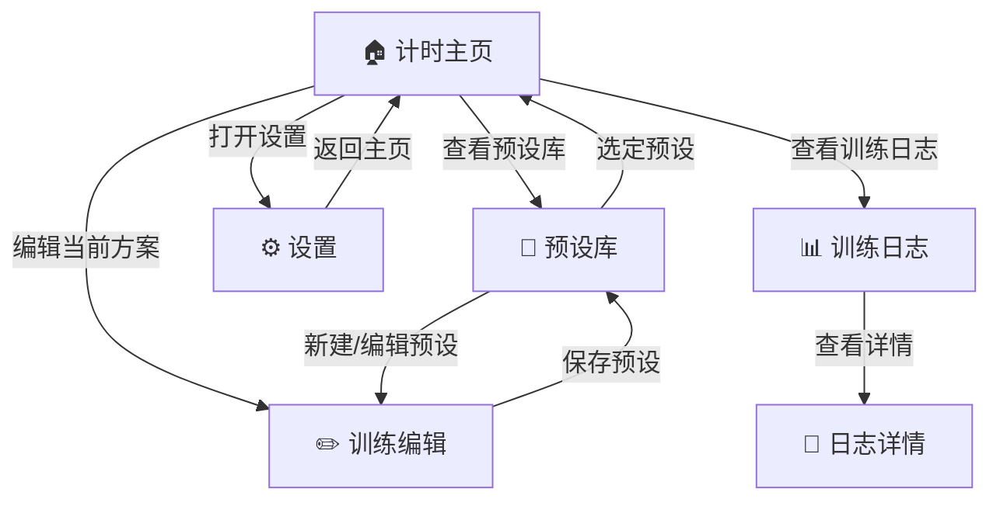

# Boxing Timer Pro - 产品设计文档

## 📋 文档概述

本文档基于《Boxing Timer 产品说明书》，整理出Boxing Timer Pro的核心功能模块和设计规划，为后续开发提供清晰的产品设计指导。

---

## 🎯 产品定位

**一句话定位**：专业拳击/搏击训练计时器Web应用，提供精准计时和多样化提示，帮助用户高效管理训练节奏。

**用户价值**：让训练者专注训练本身，无需分心计算时间，通过灵活的计时设置和强大的提示系统提升训练效率。

**核心场景**：搏击训练中用户设定回合参数，启动计时后专心训练，应用自动在各阶段提供清晰提示。

---

## 👥 目标用户

### 主要用户画像

**搏击教练 Alex（35岁）**
- 拳馆授课，需要可靠计时工具管理学生训练
- 关注快速切换训练方案，响亮清晰的全场控制信号
- 常将设备连接音箱，在嘈杂环境使用

**个人训练者 Lin（28岁）**
- 居家HIIT和拳击沙袋训练
- 需要戴手套情况下的易操作计时器
- 重视应用直观性和训练数据统计

---

## 🏗️ 核心功能模块

### 1. 计时引擎模块
**功能描述**：高精度多阶段计时系统

**核心功能**：
- 回合计时（支持自定义时长）
- 休息计时（回合间休息）
- 准备计时（开始前准备时间）
- 警告计时（回合结束前警告）
- 暂停/继续/重置控制
- 精度要求：±20ms（前台），±50ms（后台）

**技术实现**：
- Web Worker + Web Audio API 高精度计时
- 状态机管理（STOPPED → READY → RUNNING → PAUSED → COMPLETED）
- Screen Wake Lock API 防止锁屏

### 2. 提示系统模块
**功能描述**：多模式训练提示和反馈

**核心功能**：
- 音频提示（铃声、哨声、蜂鸣音）
- 语音播报（TTS合成，如"第X回合开始"）
- 振动提醒（设备支持时）
- 视觉提示（屏幕闪烁、颜色变化）
- 倒计时语音（最后10秒倒数）

**提示节点**：
- 训练开始/准备开始
- 回合开始/结束
- 休息开始/结束  
- 警告阶段进入
- 训练完成

**技术实现**：
- Web Audio API 音频播放
- Speech Synthesis API 语音合成
- Vibration API 振动控制
- 蓝牙音频延迟补偿机制

### 3. 预设管理模块
**功能描述**：训练方案的保存和管理系统

**核心功能**：
- 预设创建（自定义回合参数）
- 预设保存/命名
- 预设库浏览和选择
- 预设编辑/复制/删除
- 快速加载预设参数

**数据结构**：
```json
{
  "id": 3,
  "name": "MMA 高强度",
  "roundTime": 300,     // 回合时长（秒）
  "restTime": 60,       // 休息时长（秒）  
  "prepareTime": 10,    // 准备时长（秒）
  "warningTime": 10,    // 警告时长（秒）
  "roundCount": 5,      // 回合数
  "soundScheme": "经典铃声"
}
```

### 4. 训练日志模块
**功能描述**：训练记录的自动保存和统计分析

**核心功能**：
- 自动记录训练完成情况
- 历史训练列表展示
- 训练详情查看
- 简单统计分析（总时长、训练次数等）
- 本地数据持久化

**记录内容**：
- 训练日期时间
- 使用的预设或自定义参数
- 实际完成回合数
- 总用时
- 训练备注（可选）

### 5. 设置与个性化模块
**功能描述**：用户体验定制化配置

**核心功能**：
- 界面主题（深色/浅色模式）
- 字体大小调整
- 色盲友好模式
- 音量和振动强度调节
- 语音提示开关
- 音频延迟校准
- 省电模式

**无障碍支持**：
- WCAG 2.2 AA 标准对比度
- 屏幕阅读器ARIA标签
- 键盘导航支持
- 高对比度模式

---

## 🎨 用户界面架构

### 信息架构图


### 主要界面设计

**1. 计时主界面**
- 大号倒计时显示（≥72pt字体）
- 当前回合/总回合指示
- 中央开始/暂停大按钮（屏幕1/2宽度）
- 预设选择和设置入口
- 进度指示器

**2. 预设管理界面**
- 预设列表（名称+参数摘要）
- 新建/编辑预设功能
- 预设操作菜单（复制/删除）

**3. 训练编辑界面**
- 回合参数设置控件
- 实时预览总时长
- 保存/取消操作

**4. 设置界面**
- 分组设置项列表
- 主题/音频/个性化选项
- 即时预览效果

---

## ⚙️ 技术架构规划

### 前端技术栈
- **基础框架**：Vanilla JavaScript (ES6+)
- **构建工具**：Vite + PWA Plugin
- **存储方案**：IndexedDB (Dexie.js)
- **样式方案**：CSS3 + CSS Variables
- **PWA支持**：Service Worker + Web App Manifest

### 核心技术模块

**1. 计时引擎**
```javascript
// 高精度计时实现
class TimerEngine {
  constructor() {
    this.worker = new Worker('./timer-worker.js')
    this.audioContext = new AudioContext()
    this.wakeLock = null
  }
  
  async start(config) {
    // 请求屏幕常亮
    this.wakeLock = await navigator.wakeLock?.request('screen')
    // 启动Worker计时
    this.worker.postMessage({ type: 'START', config })
  }
}
```

**2. 音频管理**
```javascript
class AudioManager {
  constructor() {
    this.sounds = new Map() // 预载音效
    this.speechSynth = window.speechSynthesis
  }
  
  async preloadSounds() {
    // 预加载所有提示音
  }
  
  playSound(soundId, delay = 0) {
    // 播放提示音，支持延迟补偿
  }
}
```

**3. 数据存储**
```javascript
// IndexedDB数据层
class Database {
  constructor() {
    this.db = new Dexie('BoxingTimer')
    this.db.version(1).stores({
      presets: '++id, name, roundTime, restTime, roundCount',
      sessions: '++id, presetId, date, roundCompleted, totalTime'
    })
  }
}
```

### PWA特性
- **离线支持**：Service Worker缓存核心资源
- **可安装**：Add to Home Screen
- **原生体验**：全屏模式，启动动画
- **后台运行**：Wake Lock API + 音频保活

---

## 📊 数据模型设计

### 核心数据表

**预设表 (Presets)**
| 字段 | 类型 | 说明 |
|------|------|------|
| id | Integer | 主键，自增 |
| name | String | 预设名称 |
| roundTime | Integer | 回合时长（秒） |
| restTime | Integer | 休息时长（秒） |
| prepareTime | Integer | 准备时长（秒） |
| warningTime | Integer | 警告时长（秒） |
| roundCount | Integer | 回合数 |
| soundScheme | String | 音效方案 |
| createdAt | DateTime | 创建时间 |

**训练日志表 (Sessions)**
| 字段 | 类型 | 说明 |
|------|------|------|
| id | Integer | 主键，自增 |
| presetId | Integer | 关联预设ID |
| date | DateTime | 训练日期 |
| roundCompleted | Integer | 完成回合数 |
| totalTime | Integer | 总用时（秒） |
| notes | String | 备注信息 |
| isCompleted | Boolean | 是否完成 |

**设置表 (Settings)**
| 字段 | 类型 | 说明 |
|------|------|------|
| key | String | 设置键名 |
| value | String | 设置值 |
| type | String | 数据类型 |

---

## 🎯 用户体验设计

### 交互设计原则
1. **单手可操作**：主要控件在拇指区域
2. **大按钮设计**：所有触控区域≥44×44dp
3. **防误触**：关键操作需确认或长按
4. **即时反馈**：按压效果、振动反馈
5. **无障碍友好**：高对比度、ARIA标签

### 响应式设计断点
- **手机竖屏**：≤480px，单列布局
- **手机横屏/平板**：481-1024px，居中布局
- **桌面端**：≥1024px，固定宽度居中

### 视觉设计规范
- **配色方案**：深色主题为主，相位颜色区分
- **字体系统**：系统无衬线+等宽数字
- **间距系统**：8dp基准网格
- **动效设计**：0.2s快速过渡，重点反馈

---

## 🔧 性能与质量要求

### 非功能性需求

**性能指标**
- 冷启动时间：≤1.5秒（4G网络）
- 应用包大小：≤200KB（不含音频）
- 计时精度：前台±20ms，后台±50ms
- 电池消耗：30分钟训练≤5%电量

**可靠性要求**
- 崩溃率：<0.1%（千次使用<1次崩溃）
- 主要功能成功率：≥99%
- 后台运行稳定性：30分钟不中断

**兼容性支持**
- iOS Safari 15+
- Chrome Mobile 90+
- Android WebView 90+
- 桌面Chrome/Firefox/Edge最新版

---

## 📋 开发里程碑

### MVP阶段（3周）- 核心功能
**目标**：可用的基础计时器

✅ **已完成**：
- 计时引擎基础架构
- 音频管理系统
- 数据存储系统
- UI控制系统
- PWA基础支持

🔄 **进行中**：
- UI界面完善（按设计规范更新完毕）
- 预设管理界面实现
- 训练日志界面
- 设置界面

### V1.0阶段（2周）- 功能完善
**目标**：完整功能的稳定版本

📋 **计划**：
- 完善所有核心功能模块
- 音频文件集成
- 全面兼容性测试
- 性能优化
- 无障碍性完善

### V1.1阶段（1周）- 优化增强
**目标**：用户体验优化

📋 **计划**：
- 用户反馈收集和修复
- 性能进一步优化
- 新增音效和主题
- 高级统计功能

---

## 🚦 风险控制

### 主要技术风险

**iOS后台限制**
- 风险：锁屏3分钟后计时暂停
- 缓解：Wake Lock API + 音频保活
- 降级：提示用户保持屏幕常亮

**音频播放限制**
- 风险：浏览器自动播放阻止
- 缓解：用户手势解锁音频权限
- 降级：视觉提示替代

**设备兼容性差异**
- 风险：API支持不一致
- 缓解：渐进增强设计
- 降级：功能优雅降级

### 用户体验风险

**戴手套操作困难**
- 缓解：大按钮设计（≥48dp）
- 测试：实际手套可用性验证

**蓝牙音频延迟**
- 缓解：延迟校准设置
- 补充：多通道提示（视觉+振动）

---

## 📈 成功指标

### 功能指标
- [ ] 计时精度达标（±20ms前台，±50ms后台）
- [ ] 核心功能成功率≥99%
- [ ] 支持设备覆盖率≥95%

### 性能指标  
- [ ] 加载时间≤1.5秒
- [ ] 应用包大小≤200KB
- [ ] 崩溃率<0.1%

### 用户体验指标
- [ ] 戴手套操作成功率≥99%
- [ ] WCAG 2.2 AA无障碍标准
- [ ] 新用户无指导完成率≥99%

---

## 🔄 迭代规划

### 近期优化
1. **音频体验**：添加更多音效选择
2. **数据分析**：增强统计图表
3. **外接设备**：TV投屏支持
4. **社交功能**：训练分享

### 远期展望
1. **智能功能**：AI训练建议
2. **硬件集成**：心率监测
3. **云端服务**：数据同步
4. **平台扩展**：移动App

---

## ✅ 验收标准

### 功能验收
- [ ] 所有核心功能正常工作
- [ ] 预设保存和加载准确
- [ ] 训练日志记录完整
- [ ] 设置项即时生效

### 体验验收
- [ ] 界面响应流畅
- [ ] 操作逻辑清晰
- [ ] 错误处理友好
- [ ] 离线功能正常

### 质量验收
- [ ] 性能指标达标
- [ ] 兼容性测试通过
- [ ] 无障碍检查通过
- [ ] 安全性评估通过

---

📅 **文档更新时间**：2024年12月19日  
🔄 **状态**：设计阶段 → 开发实施  
📝 **下一步**：启动MVP功能开发实施