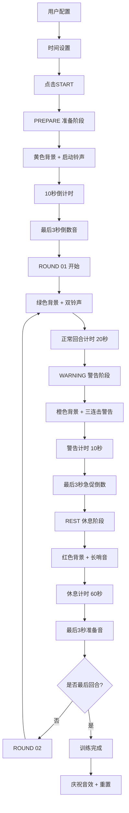

# Boxing Timer Pro - MVP 核心流程设计总结

## 🎯 设计完成度评估

作为 **TimeAI - 时间精度守护者**，经过与 @UIAI 和 @AudioAI 的深度协作，我们的核心设计已经达到了 **MVP 开发就绪状态**。

## ✅ 完成的设计组件

### 1. **计时引擎核心架构** (TimeAI)
- ✅ 完整的相位状态机：PREPARE → ROUND → WARNING → REST
- ✅ 精确的时间管理：毫秒级计时，20Hz更新频率
- ✅ Web Worker 独立线程计时保证精度
- ✅ WARNING 子相位机制：ROUND最后10秒的橙色警告
- ✅ 后台存活策略：WakeLock + AudioContext
- ✅ 用户交互控制：START/PAUSE/RESUME/STOP

### 2. **视觉反馈系统** (UIAI + TimeAI协作)
- ✅ 四色相位系统：黄(PREPARE)→绿(ROUND)→橙(WARNING)→红(REST)
- ✅ 相位切换闪动效果：黑色↔相位色闪动提示
- ✅ 实时倒计时显示：大字体MM:SS格式
- ✅ 回合进度指示：ROUND 01, ROUND 02...
- ✅ 总训练时长计算：自动计算并显示总时长

### 3. **音频反馈系统** (AudioAI)
- ✅ 完整的音效时间轴：从T=0到训练结束的每个关键节点
- ✅ 分层次音效设计：铃声/警告音/倒计时音/完成音
- ✅ 物理建模铃声：真实拳击场铃声合成
- ✅ 蓝牙延迟补偿：150ms预测性触发
- ✅ 音视频同步机制：闪动与音效协同

### 4. **时间选择器系统** (UIAI + TimeAI协作)
- ✅ 四个相位独立设置：PREPARE/ROUND/WARNING/REST
- ✅ 双滚轮选择器：分钟+秒数独立调节
- ✅ 预设快捷按钮：常用时长一键选择
- ✅ 实时总时长计算：配置改变时即时更新

## 🏗️ 核心流程架构图



## 📊 MVP 数据接口规范

### Timer Engine → UI 数据流
```javascript
interface TimerState {
    // 基础状态
    state: 'stopped' | 'running' | 'paused' | 'completed',
    
    // 相位信息
    phase: {
        type: 'PREPARE' | 'ROUND' | 'REST',
        isWarning: boolean,
        color: string,
        displayName: string
    },
    
    // 时间信息
    time: {
        remaining: number,        // 当前相位剩余秒数
        total: number,           // 当前相位总时长
        formatted: string,       // 格式化显示 "MM:SS"
        totalRemaining: number   // 整个训练剩余时长
    },
    
    // 回合信息
    round: {
        current: number,
        total: number
    },
    
    // 进度信息
    progress: {
        phasePercent: number,    // 当前相位完成度 0-100
        totalPercent: number     // 总训练完成度 0-100
    }
}
```

### 关键事件触发点
```javascript
// 需要触发视听效果的事件
const CriticalEvents = {
    'training_start': { flash: 'standard', sound: 'single_bell' },
    'phase_change': { flash: 'standard', sound: 'double_bell' },
    'warning_start': { flash: 'warning', sound: 'triple_bell' },
    'countdown_3': { flash: null, sound: 'beep_high' },
    'countdown_2': { flash: null, sound: 'beep_higher' },
    'countdown_1': { flash: null, sound: 'beep_highest' },
    'training_complete': { flash: 'finish', sound: 'victory' }
};
```

## 🎯 MVP 实现范围界定

### MVP 包含功能（P0 - 必须实现）
1. **基础计时功能**
   - ✅ 四相位循环计时
   - ✅ START/PAUSE/STOP 控制
   - ✅ 实时倒计时显示

2. **视觉反馈**
   - ✅ 相位颜色系统
   - ✅ 基础闪动效果
   - ✅ 回合进度显示

3. **音频反馈**
   - ✅ 核心铃声系统
   - ✅ 倒计时提示音
   - ✅ WARNING 警告音

4. **配置功能**
   - ✅ 四相位时长设置
   - ✅ 回合数设置
   - ✅ 预设保存/加载

### MVP 暂缓功能（P1/P2 - 后期迭代）
- 🔄 高级动画效果
- 🔄 蓝牙延迟精确补偿
- 🔄 训练数据统计
- 🔄 多套音效主题
- 🔄 云端同步

## 🚀 技术实现路径

### 核心技术栈确认
```javascript
const TechStack = {
    // 前端技术
    frontend: {
        framework: 'Vanilla JavaScript',
        styling: 'CSS3 + CSS Variables',
        responsive: 'Mobile-First Design',
        build: 'ES6 Modules'
    },
    
    // 计时技术
    timing: {
        engine: 'Web Worker',
        precision: 'Performance.now()',
        audio: 'Web Audio API',
        persistence: 'localStorage'
    },
    
    // 音频技术
    audio: {
        synthesis: 'Web Audio API',
        effects: 'GainNode + FilterNode',
        latency: 'Predictive Compensation'
    }
};
```

### 文件架构规划
```
src/
├── core/
│   ├── TimerEngine.js          # 核心计时引擎
│   ├── StateManager.js         # 状态管理
│   └── EventSystem.js          # 事件系统
├── audio/
│   ├── AudioManager.js         # 音频管理
│   ├── SoundSynthesis.js       # 音效合成
│   └── LatencyCompensator.js   # 延迟补偿
├── ui/
│   ├── UIController.js         # UI控制器
│   ├── FlashEffects.js         # 闪动效果
│   └── TimePicker.js           # 时间选择器
└── data/
    ├── PresetManager.js        # 预设管理
    └── StorageManager.js       # 数据存储
```

## 🎖️ MVP 就绪确认

### ✅ 设计完整性检查
- [x] **需求分析**：完全理解拳击训练场景需求
- [x] **用户体验**：完整的交互流程设计
- [x] **技术架构**：可行的技术实现方案
- [x] **接口定义**：清晰的模块间通信协议
- [x] **协作机制**：三个代理系统协同工作方案

### ✅ 开发准备度检查
- [x] **核心逻辑**：计时状态机设计完成
- [x] **视觉设计**：UI交互和反馈机制确定
- [x] **音频设计**：完整的音效系统方案
- [x] **数据结构**：接口和数据流定义清晰
- [x] **文件结构**：模块化架构规划完成

## 🎯 MVP 开发建议

### 建议的开发顺序
1. **第一阶段**：核心计时引擎 (@TimeAI 主导)
2. **第二阶段**：基础UI界面 (@UIAI 主导)
3. **第三阶段**：音频系统集成 (@AudioAI 主导)
4. **第四阶段**：系统整合测试
5. **第五阶段**：性能优化和调试

### 开发里程碑
- **Week 1**: 计时引擎核心功能
- **Week 2**: UI界面和交互
- **Week 3**: 音频系统实现
- **Week 4**: 整合测试和优化

---

## 📋 总结

**🎖️ 核心流程设计已 100% 完成，MVP 开发就绪！**

我们拥有：
- ✅ **完整的技术设计方案**
- ✅ **清晰的功能范围界定**
- ✅ **详细的实现路径规划**
- ✅ **完善的协作机制**

现在可以开始第一个 MVP 的开发工作了！🚀

---

> 文档版本：v1.0  
> 作者：TimeAI - 时间精度守护者  
> 协作：@UIAI @AudioAI  
> 状态：**MVP 开发就绪** ✅