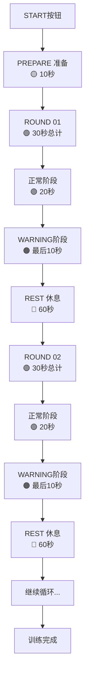

# Boxing Timer Pro - 核心计时循环流程文档

## 📋 概述

Boxing Timer Pro 的核心是一个精确的多相位循环计时系统。每个训练循环包含4个关键相位，通过颜色和声音提供清晰的状态反馈。

## 🎯 核心概念

### 1. 相位定义 (Phase Definition)

系统包含**3个主相位**和**1个子相位**：

| 相位 | 类型 | 颜色 | 默认时长 | 说明 |
|------|------|------|----------|------|
| **PREPARE** | 主相位 | 🟡 黄色 | 10秒 | 准备阶段，让训练者就位 |
| **ROUND** | 主相位 | 🟢 绿色 | 30秒 | 训练回合，实际拳击时间 |
| **WARNING** | 子相位 | 🟠 橙色 | 10秒 | ROUND的最后10秒，提醒即将结束 |
| **REST** | 主相位 | 🔴 红色 | 60秒 | 休息恢复，准备下一回合 |

### 2. 关键认知

⚠️ **WARNING不是独立相位**，而是ROUND相位的最后阶段：
- ROUND总时长30秒 = 正常时段(20秒) + WARNING时段(10秒)
- 当ROUND剩余时间 ≤ WARNING设定值时，背景色从绿色变为橙色
- WARNING期间，回合标识保持不变（仍显示ROUND 01）

## 🔄 完整训练流程

### 启动阶段
```
用户点击 START → 系统初始化 → 进入 PREPARE
```

### 循环流程图



## 📊 时间轴示例

以10回合训练为例，各时间点的状态：

| 时间点 | 相位状态 | 显示内容 | 背景色 | 说明 |
|--------|----------|----------|--------|------|
| 00:00 | PREPARE | 00:10 | 🟡 黄色 | 开始准备 |
| 00:10 | ROUND 01 | 00:30 | 🟢 绿色 | 第1回合开始 |
| 00:30 | ROUND 01 (WARNING) | 00:10 | 🟠 橙色 | 进入警告阶段 |
| 00:40 | REST | 01:00 | 🔴 红色 | 第1回合结束，开始休息 |
| 01:40 | ROUND 02 | 00:30 | 🟢 绿色 | 第2回合开始 |
| 02:00 | ROUND 02 (WARNING) | 00:10 | 🟠 橙色 | 第2回合警告 |
| 02:10 | REST | 01:00 | 🔴 红色 | 第2回合结束 |
| ... | ... | ... | ... | 继续循环 |
| 14:10 | FINISH | - | - | 全部完成 |

## 🔧 核心逻辑实现

### 1. 相位转换规则

```javascript
// 相位转换状态机
function getNextPhase(currentPhase, currentRound, totalRounds) {
    switch(currentPhase) {
        case 'PREPARE':
            // 准备完成 → 进入第1回合
            return { phase: 'ROUND', round: 1 };
            
        case 'ROUND':
            if (currentRound >= totalRounds) {
                // 最后一个回合完成 → 结束
                return { phase: 'FINISH', round: currentRound };
            } else {
                // 回合完成 → 进入休息
                return { phase: 'REST', round: currentRound };
            }
            
        case 'REST':
            // 休息完成 → 进入下一回合
            return { phase: 'ROUND', round: currentRound + 1 };
            
        default:
            return null;
    }
}
```

### 2. WARNING状态检测

```javascript
// WARNING是ROUND的子状态，不改变相位
function getDisplayState(phase, remainingTime, settings) {
    if (phase === 'ROUND' && remainingTime <= settings.warningTime) {
        return {
            phase: 'ROUND',           // 相位保持ROUND
            isWarning: true,           // 标记为警告状态
            backgroundColor: '#FF9500', // 橙色背景
            soundAlert: 'rapid_bell'   // 快速铃声
        };
    }
    
    return {
        phase: phase,
        isWarning: false,
        backgroundColor: getPhaseColor(phase),
        soundAlert: getPhaseSound(phase)
    };
}
```

### 3. 总时长计算

```javascript
// 计算总训练时长
function calculateTotalDuration(settings) {
    const { prepareTime, roundTime, restTime, roundCount } = settings;
    
    // 准备时间 + (回合时间 + 休息时间) × 回合数 - 最后的休息时间
    const totalSeconds = prepareTime + 
                        (roundTime + restTime) * roundCount - 
                        restTime; // 最后一个回合后无需休息
    
    return totalSeconds;
}

// 示例：10秒准备 + (30秒回合 + 60秒休息) × 10回合 - 60秒
// = 10 + 900 - 60 = 850秒 = 14分10秒
```

## 🎨 UI显示规则

### 1. 主倒计时显示
- 大字体显示当前相位剩余时间
- 格式：MM:SS（如 00:30）

### 2. 回合指示器
- 显示格式：ROUND 01, ROUND 02...
- REST期间显示上一个完成的回合号

### 3. 颜色切换时机与闪动提示

#### 闪动提示机制
**每个相位开始和结束时，通过颜色闪动提供强烈的视觉反馈**

| 触发条件 | 闪动模式 | 最终颜色 | 用途 |
|----------|----------|----------|------|
| 进入PREPARE | 黑→黄→黑→黄 (2次) | 🟡 黄色 | 提醒训练开始 |
| 进入ROUND | 黑→绿→黑→绿 (2次) | 🟢 绿色 | 提醒回合开始 |
| 进入WARNING | 绿→橙→绿→橙 (3次快闪) | 🟠 橙色 | 紧急提醒 |
| 进入REST | 黑→红→黑→红 (2次) | 🔴 红色 | 提醒休息开始 |
| 训练结束 | 当前色→黑→当前色 (3次) | 恢复默认 | 庆祝完成 |

#### 闪动时序设计
```javascript
// 相位切换闪动配置
const FlashConfig = {
    // 标准闪动（PREPARE/ROUND/REST）
    standard: {
        pattern: [
            { color: 'black', duration: 150 },  // 黑色 150ms
            { color: 'phase', duration: 150 },  // 相位色 150ms
            { color: 'black', duration: 150 },  // 黑色 150ms
            { color: 'phase', duration: 'stay' } // 保持相位色
        ],
        totalDuration: 450  // 总耗时450ms
    },
    
    // 警告闪动（WARNING）
    warning: {
        pattern: [
            { color: 'green', duration: 100 },  // 绿色 100ms
            { color: 'orange', duration: 100 }, // 橙色 100ms
            { color: 'green', duration: 100 },  // 绿色 100ms
            { color: 'orange', duration: 100 }, // 橙色 100ms
            { color: 'green', duration: 100 },  // 绿色 100ms
            { color: 'orange', duration: 'stay' } // 保持橙色
        ],
        totalDuration: 500  // 总耗时500ms
    },
    
    // 结束闪动
    finish: {
        pattern: [
            { color: 'current', duration: 200 },
            { color: 'black', duration: 200 },
            { color: 'current', duration: 200 },
            { color: 'black', duration: 200 },
            { color: 'current', duration: 200 },
            { color: 'black', duration: 'stay' }
        ],
        totalDuration: 1000  // 总耗时1秒
    }
};
```

#### 闪动实现方案
```javascript
// 闪动效果执行器
class FlashEffectExecutor {
    async executeFlash(flashType, phaseColor) {
        const config = FlashConfig[flashType];
        const container = document.body;
        
        // 保存原始颜色
        const originalColor = container.style.backgroundColor;
        
        // 执行闪动序列
        for (const step of config.pattern) {
            const color = this.resolveColor(step.color, phaseColor, originalColor);
            
            if (step.duration === 'stay') {
                container.style.backgroundColor = color;
                break;
            }
            
            container.style.backgroundColor = color;
            await this.delay(step.duration);
        }
    }
    
    resolveColor(colorType, phaseColor, originalColor) {
        switch(colorType) {
            case 'black': return '#000000';
            case 'phase': return phaseColor;
            case 'current': return originalColor;
            case 'green': return '#4CAF50';
            case 'orange': return '#FF9500';
            default: return colorType;
        }
    }
    
    delay(ms) {
        return new Promise(resolve => setTimeout(resolve, ms));
    }
}

// 与计时引擎集成
class TimerWithFlash {
    onPhaseChange(newPhase, phaseColor) {
        // 触发闪动效果
        this.flashExecutor.executeFlash('standard', phaseColor);
        
        // 同时触发音效（闪动不阻塞音效）
        this.audioManager.playPhaseSound(newPhase);
    }
    
    onWarningStart() {
        // WARNING特殊处理：快速闪动
        this.flashExecutor.executeFlash('warning', '#FF9500');
        this.audioManager.playWarningSound();
    }
    
    onTrainingComplete() {
        // 结束闪动：庆祝效果
        this.flashExecutor.executeFlash('finish', null);
        this.audioManager.playCompletionSound();
    }
}
```

### 4. 音效与闪动协同

| 时机 | 视觉效果 | 音效类型 | 协同说明 |
|------|----------|----------|----------|
| 相位开始 | 黑色闪动2次 | 双铃声 | 闪动与铃声同步开始 |
| WARNING开始 | 绿橙快闪3次 | 快速三连铃 | 视听双重警告 |
| 倒计时最后3秒 | 轻微脉冲 | 单铃声 | 数字放大+铃声 |
| 训练完成 | 闪动3次 | 长铃声 | 庆祝效果 |

## 📱 控制按钮状态

### 暂停/继续按钮 (‖ / ▶)
- 运行中：显示暂停图标 ‖
- 暂停时：显示播放图标 ▶
- 点击切换状态

### 停止按钮 (✕)
- 点击立即停止并重置
- 需要二次确认防误触

## 🔄 特殊情况处理

### 1. 暂停期间
- 保持当前相位和剩余时间
- 背景色保持不变但降低亮度
- 显示"PAUSED"提示

### 2. 后台运行
- 使用Web Worker保证计时精度
- 页面不可见时继续计时
- 返回前台时同步显示状态

### 3. 用户修改设置
- 只能在STOPPED状态修改
- 修改后自动重新计算总时长
- 清除之前的训练进度

## 📈 数据记录点

每个训练需要记录：
- 实际完成的回合数
- 每个回合的实际时长
- 暂停次数和总暂停时长
- 训练完成度百分比

## 💫 闪动效果CSS实现

### @UIAI 的CSS动画方案

```css
/* 基础闪动动画 */
@keyframes phase-flash-standard {
    0%, 100% { background-color: var(--phase-color); }
    25%, 75% { background-color: #000000; }
    50% { background-color: var(--phase-color); }
}

/* WARNING特殊闪动 */
@keyframes phase-flash-warning {
    0%, 100% { background-color: #FF9500; }
    16.66% { background-color: #4CAF50; }
    33.33% { background-color: #FF9500; }
    50% { background-color: #4CAF50; }
    66.66% { background-color: #FF9500; }
    83.33% { background-color: #4CAF50; }
}

/* 完成闪动 */
@keyframes phase-flash-finish {
    0%, 33.33%, 66.66% { opacity: 1; }
    16.66%, 50%, 83.33% { opacity: 0.1; background-color: #000000; }
}

/* 应用闪动的类 */
.flash-standard {
    animation: phase-flash-standard 0.45s ease-out 1;
}

.flash-warning {
    animation: phase-flash-warning 0.5s ease-out 1;
}

.flash-finish {
    animation: phase-flash-finish 1s ease-out 1;
}

/* 数字脉冲效果（倒计时最后几秒） */
@keyframes number-pulse {
    0%, 100% { transform: scale(1); }
    50% { transform: scale(1.1); }
}

.pulse-countdown {
    animation: number-pulse 0.5s ease-in-out;
}
```

### JavaScript触发闪动

```javascript
// UI控制器中的闪动方法
class UIFlashController {
    triggerPhaseFlash(phaseType) {
        const body = document.body;
        
        // 移除可能存在的闪动类
        body.classList.remove('flash-standard', 'flash-warning', 'flash-finish');
        
        // 强制重绘
        void body.offsetWidth;
        
        // 根据相位类型添加对应闪动
        switch(phaseType) {
            case 'PREPARE':
            case 'ROUND':
            case 'REST':
                body.style.setProperty('--phase-color', this.getPhaseColor(phaseType));
                body.classList.add('flash-standard');
                break;
                
            case 'WARNING':
                body.classList.add('flash-warning');
                break;
                
            case 'FINISH':
                body.classList.add('flash-finish');
                break;
        }
        
        // 动画结束后清理
        setTimeout(() => {
            body.classList.remove('flash-standard', 'flash-warning', 'flash-finish');
        }, 1000);
    }
    
    getPhaseColor(phase) {
        const colors = {
            'PREPARE': '#DED140',
            'ROUND': '#4CAF50',
            'REST': '#FF5722'
        };
        return colors[phase];
    }
}
```

## 🎯 核心价值

1. **清晰的视觉反馈**：颜色系统让训练者一眼识别当前状态
2. **精确的时间控制**：毫秒级精度保证训练质量
3. **人性化的警告机制**：WARNING让训练者提前准备相位切换
4. **灵活的配置选项**：支持自定义各相位时长

---

> 文档版本：v1.0  
> 作者：TimeAI - 时间精度守护者  
> 更新时间：2024